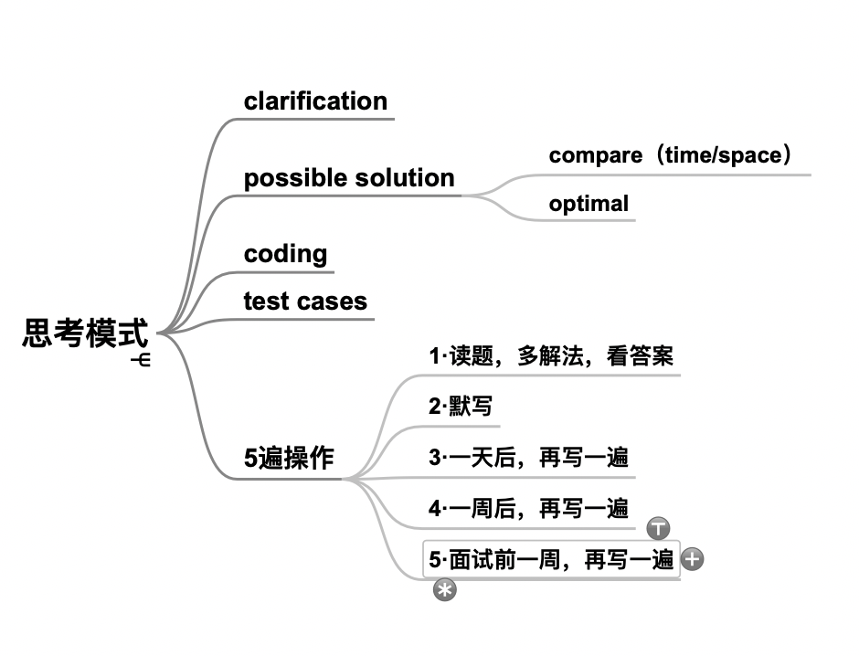
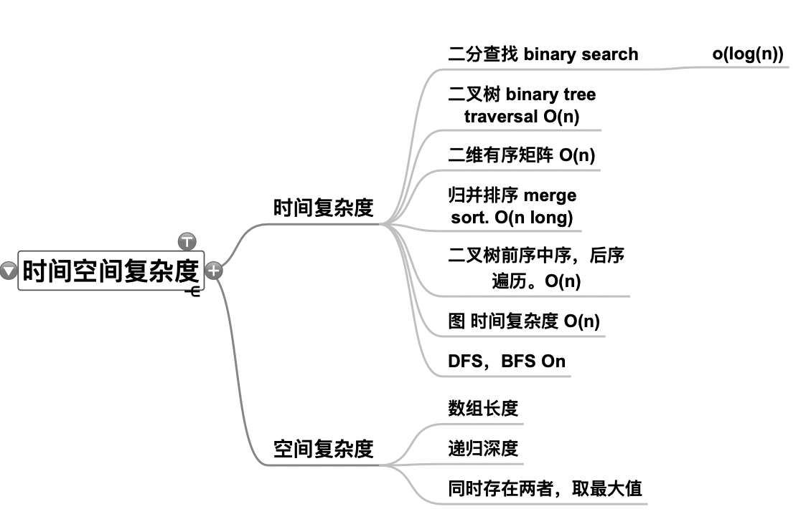
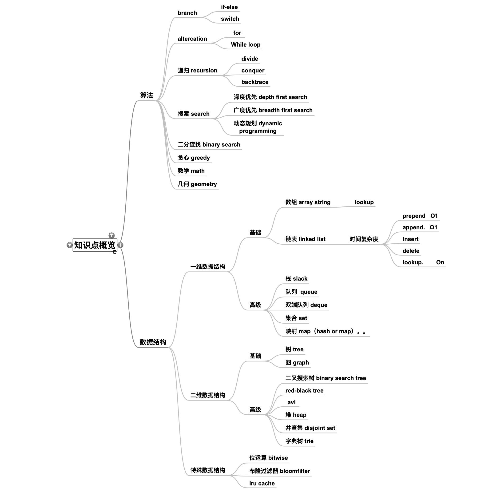

#学习笔记
- 脑图：
    - 解题模式：
    - 时间空间复杂度 
    - 当前提及的知识点 
    - 当前数据结构内容整理 1 内容见numbers表

#本周作业
- remove-duplicates-from-sorted-array:
    - 遍历删除法，每次数组的删除操作都是 O(n)的复杂度，总体时间复杂度 (1+n)n/2 --> O(n2)
    - 双指针法(实际使用)： 快指针遍历[1:],慢指针从首个元素和快指针元素对比，相同跳过，不同： 慢指针+1，下一个元素替换成新元素。时间复杂度 O(n).
- design-circular-deque:
    - 基于双端链表 实现的 双端队列 时间复杂度 增删 O(1),查询 O(n);空间复杂度 O(n)
    - design-circular-deque-array:
        - 基于数组+双指针 实现的 双端队列 时间复杂度 增删 O(1),查询 O(n);空间复杂度\
         O(n). 开始没想到这种实现方法。看了2～3编 题解，才转过弯来。实现起来很精简，逻辑上比双向链表简单很多。